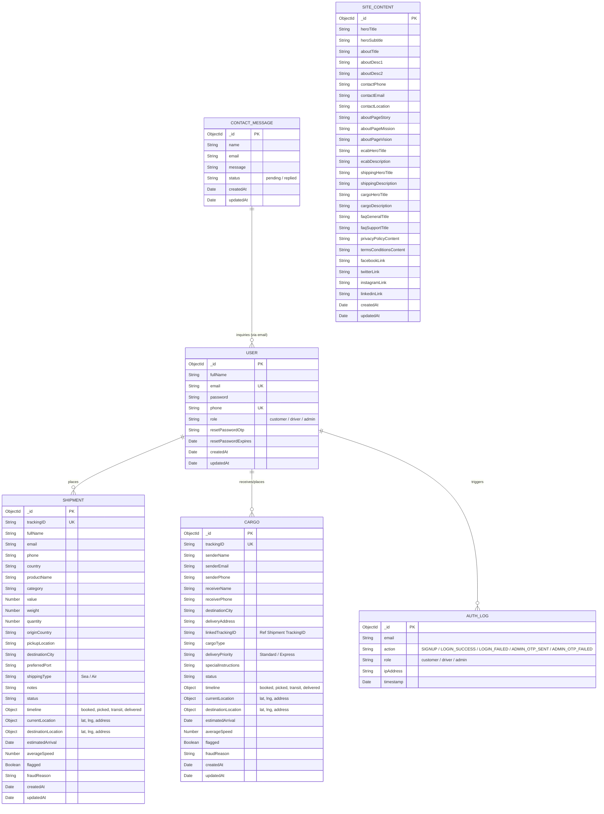

# E-DROP Database Design Documentation

This document describes the MongoDB database design and Mongoose schemas used in the **E-DROP** logistics, cab booking, and freight management application.

---

## 1. Entity-Relationship (ER) Diagram

The following diagram visualizes the data entities and how they relate to each other:

---

## 2. Collection Schemas in Detail

### 2.1. Users Collection (`User` Schema)
Stores information about registered accounts (Customers, Drivers, and Administrators).

| Field Name | Data Type | Constraints / Validators | Default Value | Description |
| :--- | :--- | :--- | :--- | :--- |
| `_id` | ObjectId | Auto-generated PK | | Unique MongoDB Identifier |
| `fullName` | String | Required | | User's full name |
| `email` | String | Required, Unique, Lowercase | | Registration email used for login |
| `password` | String | Required | | Hashed password (Bcrypt) or plain security password |
| `phone` | String | Required, Unique | | Contact telephone number |
| `role` | String | Required | `'customer'` | User's system role (`customer`, `driver`, `admin`) |
| `resetPasswordOtp` | String | Optional | | 6-digit OTP code for password resets & Admin 2FA |
| `resetPasswordExpires`| Date | Optional | | Expiry time of generated OTP |
| `createdAt` | Date | Auto-managed | | Timestamp of account creation (Signup) |
| `updatedAt` | Date | Auto-managed | | Timestamp of last profile update |

---

### 2.2. Shipments Collection (`Shipment` Schema)
Tracks sea/air shipping orders placed by users.

| Field Name | Data Type | Constraints / Validators | Default Value | Description |
| :--- | :--- | :--- | :--- | :--- |
| `_id` | ObjectId | Auto-generated PK | | Unique Identifier |
| `trackingID` | String | Required, Unique | | Format: `EDROP-SHIP-XXXXXXXX` |
| `fullName` | String | Required, Trimmed | | Name of the sender |
| `email` | String | Required, Lowercase | | Email of the sender |
| `phone` | String | Required | | Contact phone number |
| `country` | String | Required | | Destination/Origin country reference |
| `productName` | String | Required | | Name of goods being shipped |
| `category` | String | Required | | Goods category (e.g. electronics, apparel) |
| `value` | Number | Required | | Declared package value (USD/PKR) |
| `weight` | Number | Required | | Weight of shipment in kilograms |
| `quantity` | Number | Required | | Quantity of pieces |
| `originCountry` | String | Required | | Country of shipment dispatch |
| `pickupLocation` | String | Required | | Address where courier picks up parcel |
| `destinationCity` | String | Required | | Target city for delivery |
| `preferredPort` | String | Required | | Port of arrival / departure |
| `shippingType` | String | Required | | e.g. `Sea Shipping` or `Air Shipping` |
| `notes` | String | Optional | | Special sender notes or declarations |
| `status` | String | | `'Order Submitted'` | Current delivery status |
| `timeline` | Object | Nested timestamps | | Dates when status changed: `booked`, `picked`, `transit`, `delivered` |
| `currentLocation` | Object | Coordinates & address | | Live location: `{ lat: Number, lng: Number, address: String }` |
| `destinationLocation`| Object | Coordinates & address | | Target location: `{ lat: Number, lng: Number, address: String }` |
| `estimatedArrival` | Date | | | Smart ETA recalculated on travel speed |
| `averageSpeed` | Number | | `60` | Average travel speed in km/h |
| `flagged` | Boolean | | `false` | Security check status |
| `fraudReason` | String | Optional | | Reason if shipment is flagged suspicious |

---

### 2.3. Inland Cargo Collection (`Cargo` Schema)
Tracks heavy logistics and freight transit across cities on highways.

| Field Name | Data Type | Constraints / Validators | Default Value | Description |
| :--- | :--- | :--- | :--- | :--- |
| `_id` | ObjectId | Auto-generated PK | | Unique Identifier |
| `trackingID` | String | Required, Unique | | Format: `EDROP-CARGO-XXXXXXXX` |
| `senderName` | String | Required, Trimmed | | Sender name |
| `senderEmail` | String | Required, Lowercase | | Sender email |
| `senderPhone` | String | Required | | Sender phone |
| `receiverName` | String | Required, Trimmed | | Name of receiver |
| `receiverPhone` | String | Required | | Phone of receiver |
| `destinationCity` | String | Required | | City of drop-off |
| `deliveryAddress` | String | Required | | Delivery address of drop-off |
| `linkedTrackingID` | String | Optional | | References a sea Shipment tracking ID if linked |
| `cargoType` | String | Required | | Type of freight cargo (e.g. containers, dry bulk) |
| `deliveryPriority` | String | Required | | Priority type: `Standard` / `Express` |
| `specialInstructions`| String | Optional | | Delivery instructions |
| `status` | String | | `'Order Submitted'` | Delivery status |
| `timeline` | Object | Nested timestamps | | Change dates: `booked`, `picked`, `transit`, `delivered` |
| `currentLocation` | Object | Coordinates & address | | Default: Islamabad warehouse coordinates |
| `destinationLocation`| Object | Coordinates & address | | Default: Karachi destination coordinates |
| `estimatedArrival` | Date | | | Smart ETA recalculated on vehicle speed |
| `averageSpeed` | Number | | `50` | Average travel speed for trucks in km/h |
| `flagged` | Boolean | | `false` | Suspicion flag |
| `fraudReason` | String | Optional | | Reason if cargo is flagged suspicious |

---

### 2.4. Contact Messages Collection (`Contact` Schema)
Stores customer messages sent via the contact form.

| Field Name | Data Type | Constraints / Validators | Default Value | Description |
| :--- | :--- | :--- | :--- | :--- |
| `_id` | ObjectId | Auto-generated PK | | Unique Identifier |
| `name` | String | Required | | Name of contact person |
| `email` | String | Required | | Email address for contact response |
| `message` | String | Required | | Customer message content |
| `status` | String | | `'pending'` | Ticket status (`pending` or `replied`) |
| `createdAt` | Date | Auto-managed | | Ticket timestamp |

---

### 2.5. Authentication Logs Collection (`AuthLog` Schema)
Logs every registration and authentication event (Signup, Login successes/failures, OTP triggers) for security auditing.

| Field Name | Data Type | Constraints / Validators | Default Value | Description |
| :--- | :--- | :--- | :--- | :--- |
| `_id` | ObjectId | Auto-generated PK | | Unique Identifier |
| `email` | String | Required | | Email of the user attempting auth |
| `action` | String | Required | | `SIGNUP`, `LOGIN_SUCCESS`, `LOGIN_FAILED`, `ADMIN_OTP_SENT`, `ADMIN_OTP_FAILED` |
| `role` | String | | `'customer'` | User's role or `unknown` (if email unregistered) |
| `ipAddress` | String | Optional | | IP address of request (IPv4 or IPv6) |
| `timestamp` | Date | | `Date.now` | Exect date/time the auth event occurred |

---

### 2.6. Site Content Collection (`SiteContent` Schema)
Stores dynamic text headings, contact coordinates, and policy declarations across pages.

| Feature Area | Field Name | Data Type | Default Value | Description |
| :--- | :--- | :--- | :--- | :--- |
| **Home Page** | `heroTitle` | String | `"MOVING WAS NEVER..."` | Primary homepage hero title |
| | `heroSubtitle` | String | `"FAST & SECURE MOVE"` | Sub-title |
| | `aboutTitle` | String | `"TRANSPORT & LOGISTICS"`| About Us heading |
| | `aboutDesc1` | String | `"E-DROP is committed..."` | Main descriptions |
| | `aboutDesc2` | String | `"We offer innovative..."` | Secondary description |
| | `contactPhone` | String | `"+92 321-125687"` | Main contact phone |
| | `contactEmail` | String | `"sachdeva@coin.sin"` | Main contact email |
| | `contactLocation`| String | `"Sadar Bazar, Peshawar"` | Office address |
| **About Page**| `aboutPageStory` | String | `"Our story started..."` | Story content |
| | `aboutPageMission`| String | `"To provide the most..."` | Mission statement |
| | `aboutPageVision`| String | `"To become the..."` | Vision statement |
| **Services** | `ecabHeroTitle` | String | `"BOOK YOUR RIDE..."` | eCab booking header |
| | `ecabDescription`| String | `"Comfortable and safe..."`| eCab description |
| | `shippingHeroTitle`| String | `"RELIABLE PARCEL..."` | eShipping header |
| | `shippingDescription`| String| `"Fast door-to-door..."` | eShipping description |
| | `cargoHeroTitle` | String | `"HEAVY LOGISTICS..."` | eCargo header |
| | `cargoDescription`| String | `"Efficient freight..."` | eCargo description |
| **FAQ Page** | `faqGeneralTitle`| String | `"GENERAL QUESTIONS"` | FAQ category 1 title |
| | `faqSupportTitle`| String | `"SUPPORT & HELP"` | FAQ category 2 title |
| **Legal** | `privacyPolicyContent`| String| `"Your privacy is..."` | Privacy Policy document text |
| | `termsConditionsContent`| String| `"By using E-Drop..."` | Terms & Conditions document text |
| **Socials** | `facebookLink` | String | `"#"` | Facebook profile URL |
| | `twitterLink` | String | `"#"` | Twitter profile URL |
| | `instagramLink` | String | `"#"` | Instagram profile URL |
| | `linkedinLink` | String | `"#"` | LinkedIn profile URL |

---

## 3. Relationships and Constraints

1. **User Identity Relation**:
   - `User.email` connects logically to `Shipment.email` and `Cargo.senderEmail`.
   - `User.phone` connects logically to `Shipment.phone` and `Cargo.senderPhone`.
   
2. **Cargo Ref Link**:
   - `Cargo.linkedTrackingID` refers to a `Shipment.trackingID` for multimodal shipping (e.g. Port to Inland Destination transport of incoming sea containers).

3. **Audit Log Trail**:
   - `AuthLog.email` tracks signup/login actions triggered by user emails. If a login fails because the email is not registered, the `role` is stored as `unknown`.
